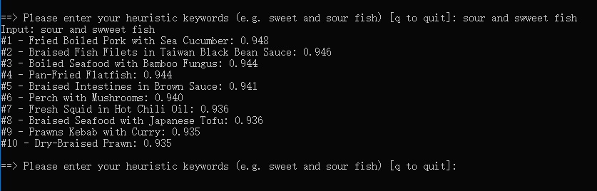

# Food  
This is a group project for CS229, categorized in Natural Language Process.

More details would be in this [poster]().

## Motivation
Have you ever walked into a restaurant ordering a certain dish, but had no idea what to pair with it? Or you
are making dinner and have one dish in mind, but can’t decide what other dishes you should cook to give your taste
buds the greatest enjoyment?
Our project intends to address this common conundrum by building a model to recommend Chinese dishes
to users after they input a dish they like. Limiting our dishes to Chinese cuisines allows us to take on a more tailored
recommendation system, while still maintain a high practical value given the rising popularity and diversity of
Chinese cuisines. We hope that tackling this less touched topic of using Machine Learning for dish recommendation
can help further promote Chinese food.
While there are a lot of recommendation systems for movies, audios, books, or restaurants, surprisingly
there is hardly any for dishes. As a result, we were not able to find a suitable dataset, so we scraped data from a
popular Chinese recipe website called [Xia Chu Fang Cooking Recipe](https://www.xiachufang.com/). Utilizing this
data, we will explore word embedding algorithms and recommendation systems to build our model.


## Method

### 1. Data scrawl

```chef_spider.py``` 
- Utilize parallel scrawling and proxies to fetch data more efficiently
- We run this spider on Google Cloud, which created two virtual machines and each contains 8vCPUs.

### 2. Map to fixed dictionary

```preprocess.py```
- Map users' favorite recipes into a fixed-length dictionary, which has 1871 unique keys represents recipe names.
- This dictionary also have corresponding english transcription of its chinese recipe name.

### 3. Train models

#### Word2Vec
This content-based method could tackle the issue of cold start, and intuitively give us recommendations based on 
- your input keywords   
- other users appetites in our database 

```word2vec.py```

Usage
1. Suppose you have downloaded our repo including the models in the `models` directory.
2. Then you just need to execute this script by typing `python word2vec.py`

This is our sample output:



Tips
- You may need to install some dependencies by run `pip install -r requirements.txt`. 
- If you really don't want to see any warnings, you can simply use this command `python -W ignore word2vec.py`.
- The visualization by T-SNE is in the `res` folder, you can see the two figures ([here](res/word_tsne_full_1.html) and [here](res/word_tsne_full_2.html)) which generated by different seeds. 

    Also, we have a [sample](res/word_tsne_small.html) only trained by part data.   

#### Collaborative filtering
This user-based method give us more quantified way to measure our model by precision and recall.
  
